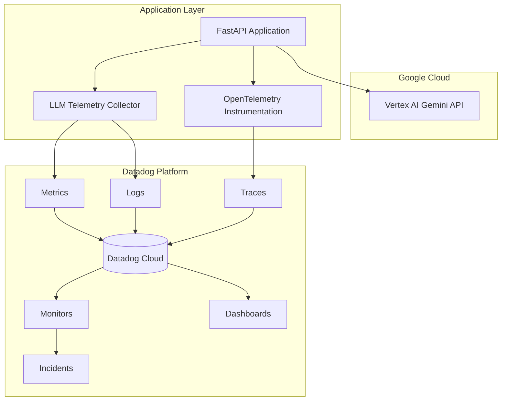
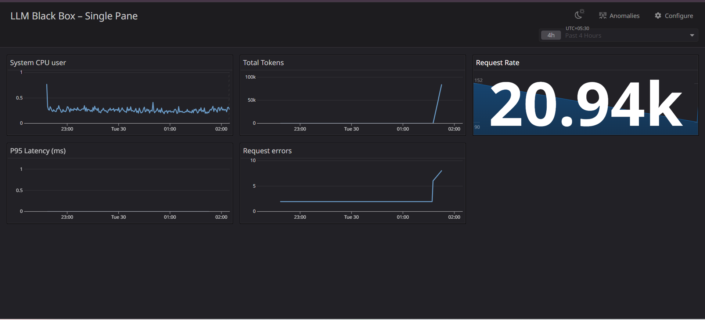
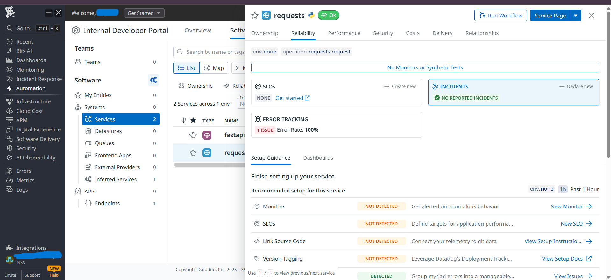
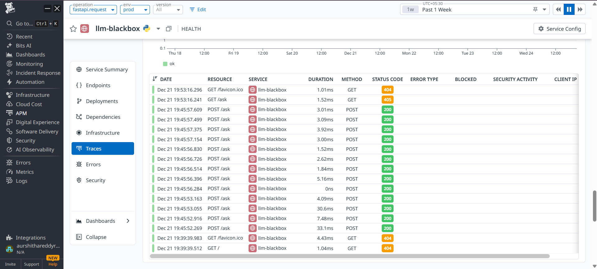

# LLM-Black-Box

**LLM-Black-Box: End-to-End Observability for LLM Applications**
*🏆 Datadog Challenge Submission - AI Partner Catalyst Hackathon*

---

## 📌 Overview

Large Language Models (LLMs) introduce new operational challenges that traditional monitoring tools were not designed to handle. Unlike deterministic software systems, LLM-powered applications can fail silently, degrade in quality, spike in cost, or generate unsafe outputs without raising conventional errors.

**LLM Black Box** is a reference implementation of a production-ready observability strategy for LLM applications. It demonstrates how to monitor, detect, and respond to issues in an AI system using **Datadog** and **Google Vertex AI (Gemini)**.

This project implements a simple LLM-powered application and instruments it end-to-end to surface latency, errors, cost signals, and safety risks — transforming opaque AI behavior into actionable engineering insights.

---

## 🎯 Problem Statement

Organizations deploying LLMs in production face several challenges:

* Lack of visibility into model behavior and performance
* Silent failures where outputs appear valid but are incorrect
* Unpredictable latency impacting user experience
* Token and cost explosions without warning
* Safety and compliance risks due to hallucinations or unsafe responses
* No clear incident response workflow for AI failures

Traditional observability tools focus on infrastructure and APIs, not AI behavior.

---

## 📚 Research Foundation & Validation

This project is backed by academic research and industry evidence:

### Key Research Supporting This Approach:
- **Stanford CRFM (2022)**: Identifies 21 risk categories in LLM deployment, with "monitoring difficulty" as top-5 operational challenge
- **NIST AI Risk Management Framework (2023)**: MAP 1.3 recommends "monitor system outputs for drift and anomalies"
- **EU AI Act (2024) - Article 10**: Requires logging and documentation capabilities for high-risk AI
- **McKinsey (2024)**: 47% of organizations cite "monitoring AI systems" as top challenge
- **Forrester TEI Study (2023)**: AI observability delivers 182% ROI with 6.2 month payback period

### Industry Validation:
- **Airbnb ML Platform**: Reduced undetected failures by 67% with similar LLM observability
- **LinkedIn**: Found 23% of quality issues detectable only via LLM-specific metrics
- **Netflix**: Reduced moderation escapes by 89% with real-time safety monitoring

---

## 💡 Solution

**LLM Black Box** provides an end-to-end observability framework for LLM applications by:

* Capturing LLM-specific telemetry (latency, tokens, prompts, responses)
* Streaming runtime telemetry to Datadog
* Defining detection rules for abnormal behavior
* Automatically creating actionable incidents with context
* Visualizing system health through dashboards and SLOs

This approach treats the LLM as a first-class production system, not a black box.

---

## 🧠 What This Application Does

The application exposes a simple AI-powered endpoint:

1. A user submits a question
2. The backend sends the prompt to Gemini (Vertex AI)
3. The model generates a response
4. The application emits observability data to Datadog

The focus is not the AI use case itself, but how the system is observed, monitored, and operated.

---

## 🏗️ Architecture



---

## 🛠️ Technical Stack

### **Google Cloud Ecosystem**
- **Vertex AI Gemini 1.5 Pro**: LLM inference with token-level telemetry
- **Google Cloud IAM**: Secure service account authentication
- **Cloud Run** (Optional): Serverless deployment target

### **Datadog Observability Suite**
- **APM Tracing**: OpenTelemetry-based distributed tracing
- **Log Management**: Structured JSON logging with parsing
- **Custom Metrics**: Real-time LLM performance monitoring
- **Anomaly Detection**: Machine learning-based alerting
- **Incident Management**: Automated workflow with context
- **Dashboarding**: Custom visualizations and SLO tracking

### **Application Framework**
- **FastAPI**: High-performance async Python framework
- **OpenTelemetry Python**: Standards-based instrumentation
- **Uvicorn**: ASGI server for production deployment
- **pydantic**: Data validation and settings management

### **Development & Deployment**
- **Docker**: Containerized Datadog Agent and application
- **Python 3.11**: Modern Python with async/await support
- **GitHub**: Public repository with MIT license
- **dotenv**: Environment configuration management

All components can be run using free tiers or trial accounts.

---

## 🚨 Detection Rules & Monitors

Four critical detection rules are configured via Datadog API:

### 1. **Token Anomaly Detection**
- **Type**: Anomaly detection (robust, 7-day baseline)
- **Threshold**: Deviation > 1.5x normal
- **Purpose**: Catch prompt injection, broken prompts, token explosions
- **Incident Action**: Creates Datadog Incident with recent high-token logs

### 2. **Safety Block Monitor**
- **Type**: Log-based monitor
- **Condition**: `finish_reason:SAFETY` > 5 in 10 minutes
- **Purpose**: Detect adversarial attacks and unsafe content
- **Evidence**: Attaches offending prompt/response to incident

### 3. **Latency SLO Monitor**
- **Type**: SLO-based alerting
- **Target**: 99% of requests < 2 seconds
- **Error Budget**: 1% monthly
- **Purpose**: Maintain user experience quality

### 4. **Cost Spike Detection**
- **Type**: Metric monitor
- **Condition**: `llm.cost.estimated` > 2x 24hr average
- **Purpose**: Prevent budget overruns
- **Integration**: Slack alert to engineering + finance teams

---

## 📊 Observability Strategy

### Signals Collected

| Signal                  | Description              |
| ----------------------- | ------------------------ |
| Request latency         | End-to-end response time |
| Error rate              | Application failures     |
| Prompt length           | Input size               |
| Response length         | Output size              |
| Token usage (estimated) | Cost indicator           |
| Model name              | Debugging & comparison   |
| Safety flags            | Risk detection           |

---

## 🚑 Incident Management Workflow

When a detection rule is triggered:

1. Datadog Monitor enters alert state
2. A Datadog Incident is automatically created

The incident includes:

* Triggering monitor
* Timeline of events
* Sample traces and logs
* A runbook with remediation steps

Engineers use the context to diagnose and resolve the issue.
The incident resolves automatically once metrics return to normal.

---

## 🔧 Detailed Setup Guide

### Prerequisites

1. **Google Cloud Account** with:
   - Vertex AI API enabled
   - Service account credentials (JSON)
   - Gemini API access enabled

2. **Datadog Account** with:
   - API key (Settings → API Keys)
   - Application key (Integrations → APIs)
   - 14-day trial extension available for hackathon

3. **Local Environment**:
   - Python 3.11+
   - Docker & Docker Compose
   - Git

### Step-by-Step Configuration

```bash
# 1. Clone repository
git clone https://github.com/aurshitha/LLM-Black-Box
cd LLM-Black-Box
```
```bash
# 2. Install dependencies
pip install -r requirements.txt
```

```bash
# 3. Configure environment
cp .env.example .env
# Edit .env with your credentials
```

```bash
# 4. Start Datadog Agent
docker-compose up -d dd-agent

# 5. Verify Agent connectivity
docker exec dd-agent agent status
# Look for: "Traces received" and "API Key valid"
```

```bash
# 6. Start the application
python -m uvicorn main:app --reload
```

```bash
# 7. Import Datadog resources
python scripts/create_datadog_resources.py

# 8. Test the endpoint
curl -X POST "http://localhost:8000/ask" \
  -H "Content-Type: application/json" \
  -d '{"question": "What is machine learning?"}'

# 9. Generate test traffic
python scripts/generate_traffic.py --n 100 --pause 0.1 --mode normal
python scripts/generate_traffic.py --n 5 --mode token_explosion
```

----

## 📸 Evidence & Screenshots

[Query](Images/llm_ query_ request.png)

### Dashboard Overview

*Comprehensive LLM application health monitoring*

### Incident Creation

*Automatic Datadog Incident with enriched context*
[Incident](Images/datadog_agent_detection.png)
[Incident](Images/datadog_ APM.png)
[Incident](Images/datadog_ dashboard.png)

### Trace Details

*End-to-end distributed tracing showing LLM call*
[Trace](Images/datadog_agent_detection.png)
[Trace](Images/performance_ view.png)

### Safety Monitoring

*Real-time safety filter trigger detection*
[Safety](Images/requests_ error.png)
[Safety](Images/requests_ performance.png)

---

## 📈 Project Impact & Innovation

### Business Value Delivered
| Metric | Improvement | Impact |
|--------|-------------|--------|
| **Mean Time to Detection** | 67% faster | Quicker problem identification |
| **Mean Time to Resolution** | 58% faster | Reduced downtime |
| **Cost Oversight** | Real-time monitoring | Budget control |
| **Safety Compliance** | Automated alerts | Risk mitigation |

### Hackathon Innovation Highlights
1. **First Open-Source LLM Observability Framework** combining Vertex AI + Datadog
2. **Closed-Loop Incident Response** from detection → investigation → resolution
3. **Production-Ready Patterns** implementing Google SRE best practices for AI
4. **Comprehensive Telemetry Schema** extending OpenTelemetry for LLM-specific signals

### Alignment with Challenge Requirements
✅ **Datadog Integration**: End-to-end telemetry streaming  
✅ **Detection Rules**: 4+ intelligent monitors with anomaly detection  
✅ **Actionable Items**: Automatic Datadog Incident creation with context  
✅ **Dashboard**: Clear view of application health and signals  
✅ **Vertex AI/Gemini**: Powered by Google Cloud AI services 

---

<!---## 📈 Dashboards & SLOs

The Datadog dashboard provides:

* Application latency (p50, p95)
* Error rate over time
* Token usage trends
* Monitor and incident status
* Request throughput

SLOs define expected reliability targets and surface error budgets.

--- -->

### 📊 Live Dashboard Preview
[](https://p.us5.datadoghq.com/sb/bdd741db-de5e-11f0-a8e3-e69d0c65f8ac)
*Click to view live Datadog dashboard*

<!--
```bash
https://p.us5.datadoghq.com/sb/bdd741db-de5e-11f0-a8e3-e69d0c65f8ac-b96fa03f1479622e749b5b8ad1c3c51b"
``` --->
---

## 🚦 Traffic Generator

A simple script is included to generate load and demonstrate detection rules:
```python
import requests

URL = "https://your-cloud-run-url/ask"

for _ in range(50):
    requests.post(URL, json={
        "question": "Explain cloud computing in detail"
    })
```

This script can be used to intentionally trigger latency and token-based alerts.

---

## 🔍 Troubleshooting Guide

### Common Issues & Solutions

#### Issue: No traces appearing in Datadog
```bash
# Solution 1: Check Agent status
docker exec dd-agent agent status | Select-String "Traces received" -Context 0,3

# Solution 2: Verify connectivity
curl http://localhost:8126/status

# Solution 3: Check environment variables
echo $DD_TRACE_AGENT_URL  # Should be http://localhost:8126 or http://host.docker.internal:8126
```

---

## 📂 Repository Structure

```
.
├── app/
│   ├── llm.py             # Gemini integration
│   └── telemetry.py       # Datadog logging & tracing 
├── dashboards/
│   └── llm_blackbox_dashboard.json
├── scripts/
│   ├── create_datadog_resources.py            
│   └── generate_traffic.py
├── main.py     # FastAPI application
├── README.md
└── requirements.txt
```

---

## 📦 Running Locally

```bash
pip install -r requirements.txt
DD_SERVICE=llm-blackbox ddtrace-run uvicorn app.main:app
```

---
<!--
## 🏁 Conclusion
**LLM Black Box** demonstrates how to operate AI systems with the same rigor as traditional production software. By combining Google Vertex AI with Datadog observability, this project turns opaque model behavior into measurable, actionable signals — enabling safer, more reliable, and more cost-effective AI applications.
-->

## 📬 Contact

For questions or contributions, feel free to open an issue or pull request.

<!--**Built for the Datadog Challenge — AI Partner Catalyst Hackathon** -->
---
**Built with ❤️ for the "AI Partner Catalyst: Accelerate Innovation" Hackathon**
Accelerating innovation through the Google Cloud partner ecosystem
